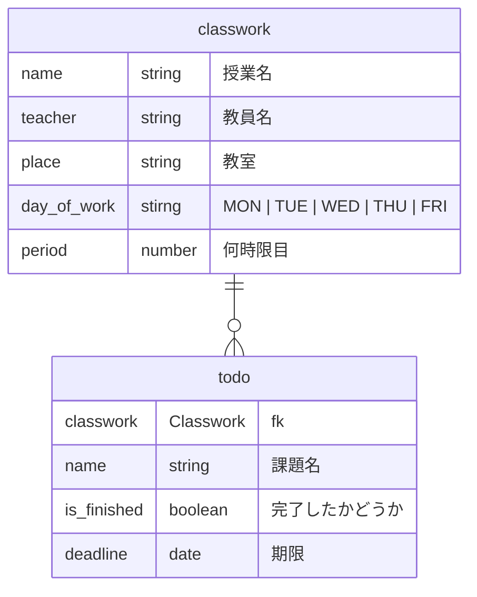

# ClassworkManager

## 概要　

このアプリは時間割と課題を管理できるアプリです。

## 機能

- 時間割の自動登録
  - 時間割が写った画像をアップロードするだけで、時間割を自動で登録できます。
- 課題管理機能 - ダッシュボード上で時間割と連動した課題リストを確認できます。
  課題の「登録・確認・完了・削除」が可能です。
- ダッシュボード表示
  - 授業予定と課題の進捗を一画面で確認でき、やるべきことが一目で分かります。

## 使用技術

Flask, Gemini API, SQLite

## 使い方

//TODO: 使い方を説明

## 環境構築＆実行方法

1. リポジトリをクローン

```
git clone https://github.com/OOP2-2025-final-G11/ClassworkManager.git
cd ClassworkManager
```

2. gemini api のキーを環境変数ファイルに入力

```
touch .env
echo "GEMINI_API_KEY = "xxxxxxxxx" >> .env
```

3. 仮想環境を作る

```
python -m venv .venv
source .venv/bin/activate
```

4. 必要なパッケージをインストール

```
pip install -r requirements.txt
```

4. 実行

```
python app.py
```

## 問い合わせ

//TODO: メンバー全員の名前と github アカウント

## ER 図


