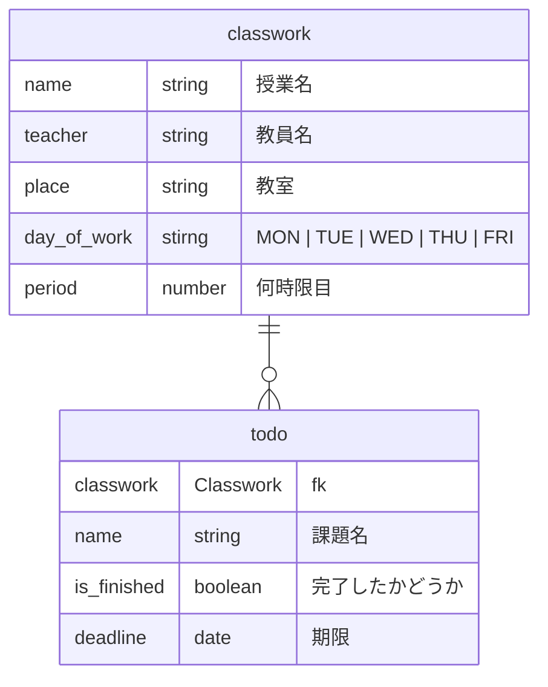

# ClassworkManager

## 概要　
このアプリは時間割と課題を管理できるアプリです。

## 機能
時間割がわかる画像をアップロードするだけで時間割登録が可能です。
ダッシュボードには時間割と課題が確認できる課題リストがあり、課題の登録、確認、完了、削除が可能です。

## 仕様
Gemini Apiに画像認識をさせ、そのデータをJSONで返させることによって自動で時間割登録をできるようにしています。

## 使い方
//TODO: 使い方を説明

## 環境構築＆実行方法

1. リポジトリをクローン

```
git clone https://github.com/OOP2-2025-final-G11/ClassworkManager.git
cd ClassworkManager
```

2. gemini api のキーを環境変数ファイルに入力

```
touch .env
echo "GEMINI_API_KEY = "xxxxxxxxx" >> .env
```

3. 仮想環境を作る

```
python -m venv .venv
source .venv/bin/activate
```

4. 必要なパッケージをインストール

```
pip install -r requirements.txt
```

4. 実行
```
python app.py
```

## 問い合わせ
//TODO: メンバー全員の名前とgithubアカウント

## ER図

