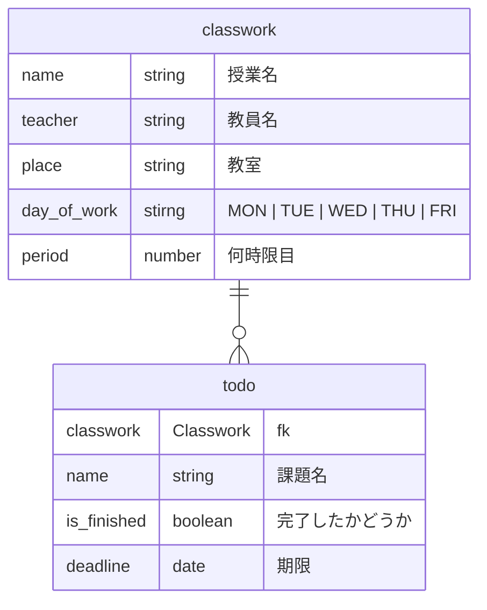

# ClassworkManager

## 概要　

このアプリは時間割と課題を管理できるアプリです。

## 機能

- 時間割の自動登録
  - 時間割が写った画像をアップロードするだけで、時間割を自動で登録できます。
- 課題管理機能 - ダッシュボード上で時間割と連動した課題リストを確認できます。
  課題の「登録・確認・完了・削除」が可能です。
- ダッシュボード表示
  - 授業予定と課題の進捗を一画面で確認でき、やるべきことが一目で分かります。

## 使用技術

Flask, Gemini API, SQLite

## 使い方

- 時間割  
1. ダッシュボードの「画像アップロード」ボタンをクリックし、画像アップロードページに進みます。　


2. 時間割の情報がある画像をアップロードします。


3. しばらくすると自動でダッシュボード画面に戻り、画像の内容がダッシュボードの時間割に反映されます。


- 課題リスト
1. ダッシュボードの「課題追加」ボタンをクリックし、課題を追加するページに進みます。


2. 「期限、授業名、内容」を入力し、登録をクリックすると課題が登録されます。
3. ダッシュボードに戻ると課題がリストで表示され、「完了」を押すと課題に横線が引かれ、「削除」ボタンを押すと課題を削除できます。「完了した課題をすべて削除」ボタンで完了した課題の一括削除も可能です。


## 環境構築＆実行方法

1. リポジトリをクローン

```
git clone https://github.com/OOP2-2025-final-G11/ClassworkManager.git
cd ClassworkManager
```

2. gemini api のキーを環境変数ファイルに入力

```
touch .env
echo "GEMINI_API_KEY = "xxxxxxxxx" >> .env
```

3. 仮想環境を作る

```
python -m venv .venv
source .venv/bin/activate
```

4. 必要なパッケージをインストール

```
pip install -r requirements.txt
```

4. 実行

```
python app.py
```

## 問い合わせ

| 氏名      | 学籍番号     | GitHubアカウント | 作業内容|
| -------------- | -------------- | -------------- | -------------- |
| 矢部大智 | K24142 | nrak126| チームリーダー |
| 内田晏大朗 | K24027 | MONSTER0126 | ダッシュボードの時間割、動画 |
| 輿水遥人| K24062 | Haruto-Koshimizu | ダッシュボードの課題リスト、README |
| 鈴木雄大 | K24082 | viciemo | 時間割の画像アップロード機能、動画 |
| 米倉彰吾 | K24147 | yonebkg | 課題追加機能、README |

## ER 図


