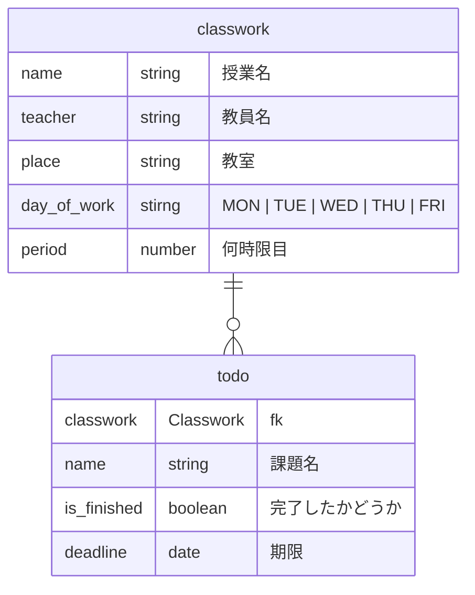

# ClassworkManager

時間割管理アプリ

## ER図

```mermaid
erDiagram

	todo {
		classwork Classwork "fk"
		name string "課題名"
		is_finished boolean "完了したかどうか"
		deadline date "期限"
	}

	classwork {
		name string "授業名"
		teacher string "教員名"
		place string "教室"
		day_of_work stirng "MON | TUE | WED | THU | FRI"
		period number "何時限目"
	}

	classwork ||--o{ todo : ""
```
