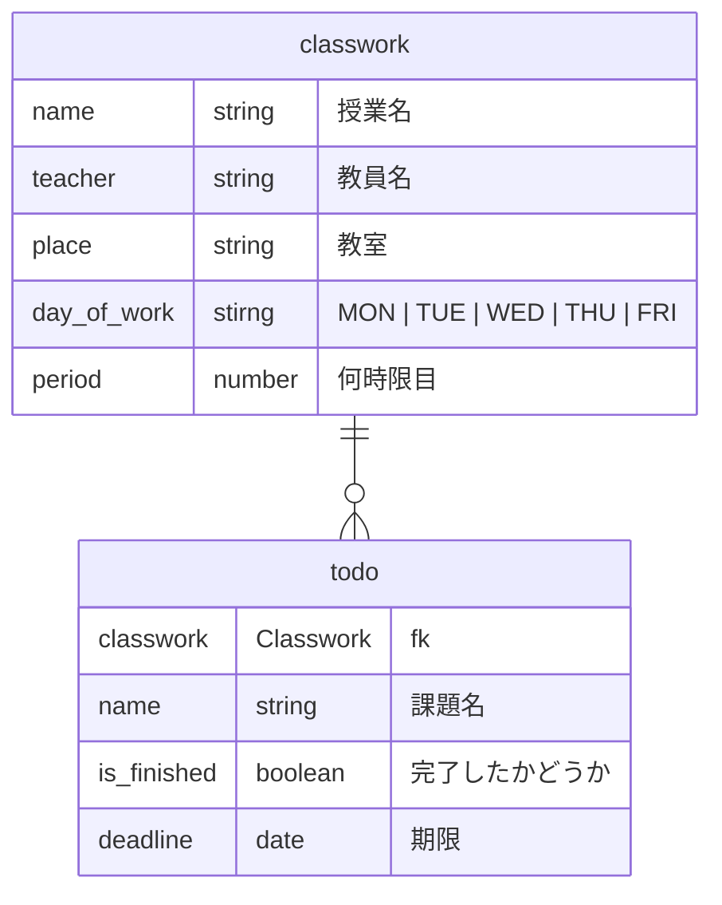

# ClassworkManager

## 概要　
このアプリは時間割と課題を管理できるアプリです。

## 機能
時間割がわかる画像をアップロードするだけで時間割登録が可能です。
ダッシュボードには時間割と課題が確認できる課題リストがあり、課題の登録、確認、完了、削除が可能です。

## 仕様
Gemini Apiに画像認識をさせ、そのデータをJSONで返させることによって自動で時間割登録をできるようにしています。

## 使い方

## 問い合わせ

## ER図

